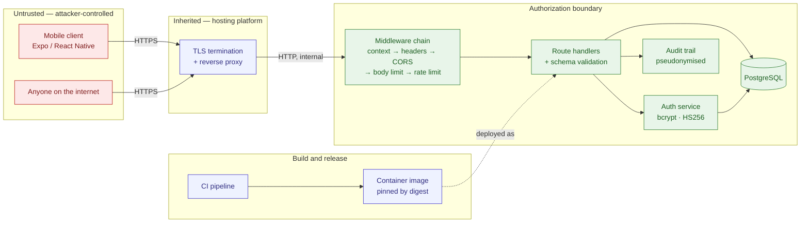

# Threat Model

Scoped to the Evergreen API, its database, and the pipeline that builds them.
Each threat states what the attacker gets, what stops them today, and what is
still open.

## Data flow and trust boundaries

Three boundaries matter:

1. **Internet → API.** Everything arriving is attacker-controlled, including
   headers. This is where validation, rate limiting and body limits sit.
2. **API → database.** The application is not the last line of defence:
   uniqueness and referential integrity are enforced by constraints, and the
   points debit runs inside a transaction.
3. **Pipeline → running service.** Whatever the pipeline produces becomes
   production. Compromising the build is equivalent to compromising the
   service.

## STRIDE

### Spoofing

| Threat | Status | Detail |
|---|---|---|
| Forging a token with a known key | **Closed** | `JWT_SECRET` defaulted to a value published in this repository; production now refuses to start without a unique secret of at least 32 bytes |
| Algorithm confusion, `alg: none` | **Closed** | Verification pins HS256 and checks the issuer |
| Enumerating registered accounts via login timing | **Closed** | Both paths perform exactly one comparison, against a decoy hash when no account exists |
| Credential stuffing | **Partial** | Per-address throttling on the credential endpoints; counters are per process and there is no per-account lockout (POAM-001) |
| Replaying a stolen token | **Open** | Tokens are stateless and valid until expiry; rotating the signing key is the only revocation available (POAM-007) |

### Tampering

| Threat | Status | Detail |
|---|---|---|
| SQL injection | **Closed** | Parameterised queries throughout; `drizzle-orm` upgraded past GHSA-gpj5-g38j-94v9 and verified against a real database |
| Modifying another user's data | **Closed** | Every query is scoped to the authenticated principal; asserted by test |
| Manipulating the points ledger | **Closed** | Balance check, debit and redemption record run in one transaction; rollback on insufficient funds is tested against PostgreSQL |
| Malformed input reaching business logic | **Closed** | Shared zod schemas validate every write, with database constraints behind them |
| Tampering with the build | **Partial** | Lockfile, `npm ci`, digest-pinned base image, least-privilege workflows; actions still resolve by mutable tag (POAM-002) |

### Repudiation

| Threat | Status | Detail |
|---|---|---|
| Denying an authentication attempt | **Closed** | Both outcomes recorded with correlation id, source address and pseudonymous subject |
| Denying a redemption | **Closed** | Ledger entry and redemption row are written in the same transaction |
| Log tampering | **Inherited** | Retention and tamper-evidence belong to the platform's logging service |

### Information disclosure

| Threat | Status | Detail |
|---|---|---|
| Credentials returned by the API | **Closed** | `toPublicUser` strips the hash; asserted by test |
| Internal detail in error responses | **Closed** | Generic body plus a correlation id; detail stays server-side |
| Personal data in logs | **Closed** | Addresses hashed before logging; a test scans emitted records for the credentials used |
| Cross-origin data theft | **Closed** | Exact-origin allowlist, no ambient credentials, wildcard rejected in production |
| Secrets in the image or repository | **Closed** | Secret scanning with a reasoned allowlist; no secret is baked into a layer |
| Database read by someone with a copy | **Partial** | Credentials are hashed; addresses and behavioural history are plaintext columns (POAM-005) |

### Denial of service

| Threat | Status | Detail |
|---|---|---|
| Oversized request bodies | **Closed** | Capped, returning `PAYLOAD_TOO_LARGE` |
| Request flooding | **Partial** | Rate limited per address; per-process counters do not hold across replicas (POAM-001) |
| Rate limiter memory exhaustion via forged addresses | **Closed** | Key count capped, expired windows evicted |
| Expensive hashing as an amplifier | **Accepted** | bcrypt at cost 12 is deliberate; the rate limiter bounds how often an attacker can trigger it |
| Volumetric attack | **Inherited** | Edge protection is the platform's |

### Elevation of privilege

| Threat | Status | Detail |
|---|---|---|
| Container escape via root | **Closed** | Runs as `node`, all capabilities dropped, `no-new-privileges`, read-only root filesystem |
| Code execution writing to the image | **Closed** | Read-only root filesystem; `/tmp` is `noexec` |
| Vulnerable dependency in the runtime | **Closed** | Shipped closure resolved exactly and gated at high severity; currently zero advisories across 36 packages |
| Build tooling reachable at runtime | **Closed** | Runtime image contains only production dependencies and compiled output |
| Compromised action in the pipeline | **Partial** | Least-privilege permissions, no persisted checkout credentials; SHA pinning outstanding (POAM-002) |

## Assumptions

Each of these is load-bearing. If one is false, the analysis above changes.

1. TLS is terminated correctly by the platform and traffic between the proxy
   and the API stays on a trusted network.
2. `TRUST_PROXY` is only enabled behind a proxy that overwrites
   `X-Forwarded-For`. If enabled without one, rate limiting is bypassable by
   rotating a header.
3. The hosting platform encrypts volumes at rest. **Unconfirmed** (POAM-005).
4. Anyone who can merge to `main` can change what runs in production; branch
   protection and review are the control, and they sit outside this repository.
5. The container platform provides tenant isolation.

## Not modelled

Physical security, insider threat from those holding production credentials,
supply-chain compromise of npm itself or of the Node.js runtime, and attacks
against the mobile client's device.
