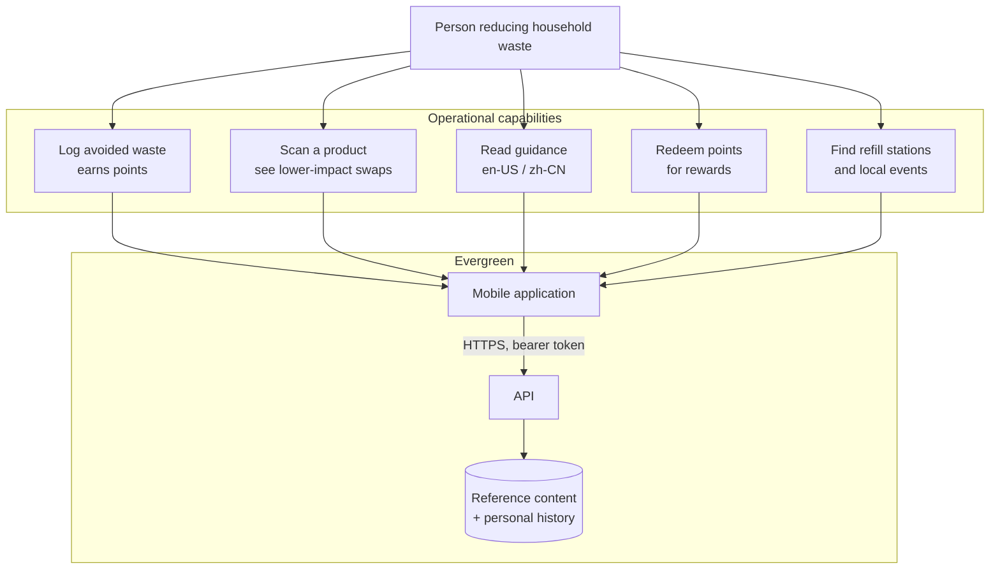
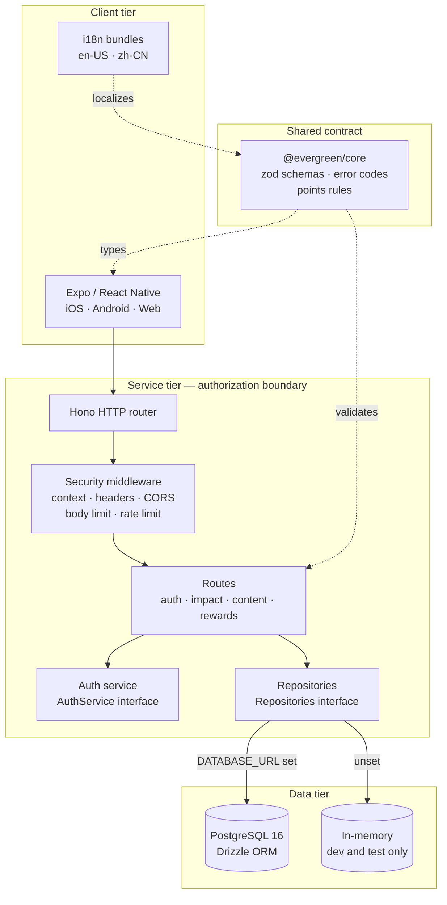
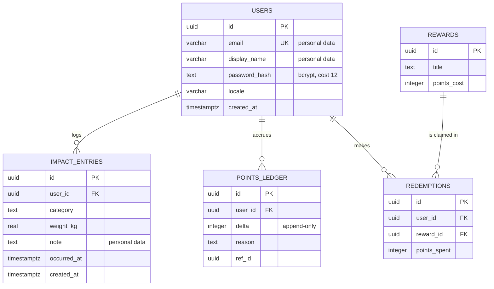

# Architecture Views

Structured as DODAF viewpoints, so the same descriptions can be reused in a
DODAF-compliant submission. Each view answers one question, and no view repeats
another.

## OV-1 — High-Level Operational Concept

*What the system does, for whom.*

Operational need: making a sustainable choice requires knowing which choice is
better and seeing that the effort accumulates. The system answers both — product
comparisons and localized guidance for the first, a points ledger and a rolling
impact summary for the second.

## SV-1 — Systems Interface Description

*What the parts are and how they connect.*

Two interfaces carry the design. `AuthService` lets a hosted identity provider
replace the self-hosted implementation without touching a route. `Repositories`
lets the same routes run against PostgreSQL or an in-memory store, chosen by
whether `DATABASE_URL` is set — which is what makes the test suite fast and the
integration suite meaningful.

`@evergreen/core` is the single definition of every request and response shape.
The API validates against it and the client types against it, so the two cannot
disagree about what is valid.

## SV-2 — Systems Resource Flow

*What crosses each boundary, and what protects it.*

| From | To | Carries | Protection |
|---|---|---|---|
| Mobile client | Platform edge | Credentials, bearer tokens, entries | TLS (inherited), HSTS asserted in production |
| Platform edge | API | Same, plus `X-Forwarded-For` | Internal network; forwarded headers ignored unless `TRUST_PROXY` |
| API | PostgreSQL | Credential hashes, personal history | Container network only; not published to the host |
| API | Log stream | Security events, pseudonymous subjects | Addresses hashed; no tokens or hashes recorded |
| Pipeline | Registry | Container image | Digest-pinned base, non-root assertion, package and config scanning |
| Registry | Runtime | Container image | Deployed by digest, never by tag |

## StdV-1 — Standards Profile

| Standard | Applied to |
|---|---|
| NIST SP 800-53 Rev 5 | Control baseline (`controls/sctm.yaml`) |
| NIST SP 800-37 Rev 2 | RMF process framing for this package |
| FIPS 199 / CNSSI 1253 | Security categorization |
| OWASP ASVS 4.0 | Application verification requirements |
| OWASP Top 10 (2021) | Threat model coverage |
| CycloneDX 1.6 | SBOM format |
| RFC 6749 / RFC 7519 | Bearer token semantics; JWT structure |
| RFC 6797 | HSTS |
| CSP Level 3 | Response content policy |
| OCI Image Format | Container image |
| BCP 47 | Locale identifiers (`en-US`, `zh-CN`) |

STIG rule identifiers are deliberately absent. They are re-numbered between STIG
releases, so binding them belongs with the ISSO against the release in force at
assessment time; `controls/sctm.yaml` carries the structure to hold them.

## DIV-2 — Logical Data Model

Balance is **derived** from the ledger rather than stored as a column. There is
no mutable total to drift out of step with its history, and every change to a
balance has a row explaining it. The debit and the redemption record are written
in one transaction, so a redemption cannot exist without its cost, or a cost
without its redemption.

Reference content — tips, products, rewards, places — carries no personal data
and is the same for every user.

### Data classification

| Data | Classification | Handling |
|---|---|---|
| Password hashes | Sensitive | bcrypt cost 12; never returned by any endpoint |
| Email addresses | Personal data | Unique-indexed; hashed before appearing in any log |
| Display names | Personal data | Returned only to the owning account |
| Impact entries and notes | Personal data | Scoped to the owning account on every query |
| Points ledger, redemptions | Personal, value-bearing | Append-only; mutated only inside a transaction |
| Tips, products, rewards, places | Public | Served without authentication |
